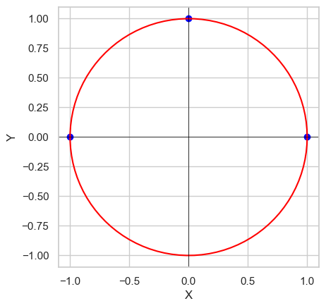
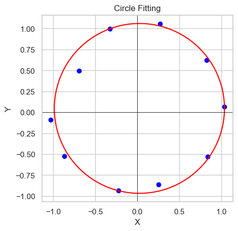

# r3fit

`r3fit` is a lightweight Rust library for fitting a circle to 2D points using a RANSAC-like method. It's built to handle noisy datasets by finding a circle that best fits the majority of inliers within a threshold.

## Features

- Fit a circle using random triplets of points
- Detect and handle collinear cases
- Configurable iterations and radius threshold
- Deterministic mode via user-supplied RNG
- Useful diagnostics (e.g. inlier counting)
- Unit + property-based testing with `proptest`

## Disclaimer

The Python bindings are not complete, and for that matter neither is the Rust library. This was mostly meant for me to use in a different project where I needed these very specific methods. I will most likely never update this ever again.

## Installation

### Rust

Add to your `Cargo.toml`:

```toml
[dependencies]
r3fit = "0.1.1"
```

Or run

```bash
$ cargo add r3fit
```

### Python

```bash
$ pip install r3fit
```

## Example (Rust)

Here's a simple example, more can be found in the unit tests.

```rust
use r3fit::Circle;

let points = vec![(0.0, 1.0), (1.0, 0.0), (-1.0, 0.0)];
let circle = Circle::fit(&points, 1000, 0.1).unwrap();

println!("{}", circle); // Circle: center=(0.0, 0.0), radius=1.0

assert_eq!(circle.x, 0.0);
assert_eq!(circle.y, 0.0);
assert_eq!(circle.r, 1.0);
```

As well as the corresponding image.



## Example (Python)

Here's a simple example for how to use it in Python.

```py
import numpy as np
import r3fit

xs = np.array([[ 1.04074565,  0.06601208],
       [ 0.82567141,  0.62465951],
       [ 0.27211257,  1.05536321],
       [-0.3230298 ,  0.99809331],
       [-0.69139874,  0.49374204],
       [-1.03243453, -0.08763805],
       [-0.86916729, -0.52544072],
       [-0.22495387, -0.93536315],
       [ 0.25773429, -0.8631605 ],
       [ 0.8385662 , -0.52786283]])

circle = r3fit.fit(xs, 1000, 0.25)
print(circle) # Circle(x: -0.010063759065123072, y: 0.0614577470528755, r: 1.033185147957909)
```

As well as the corresponding image.

